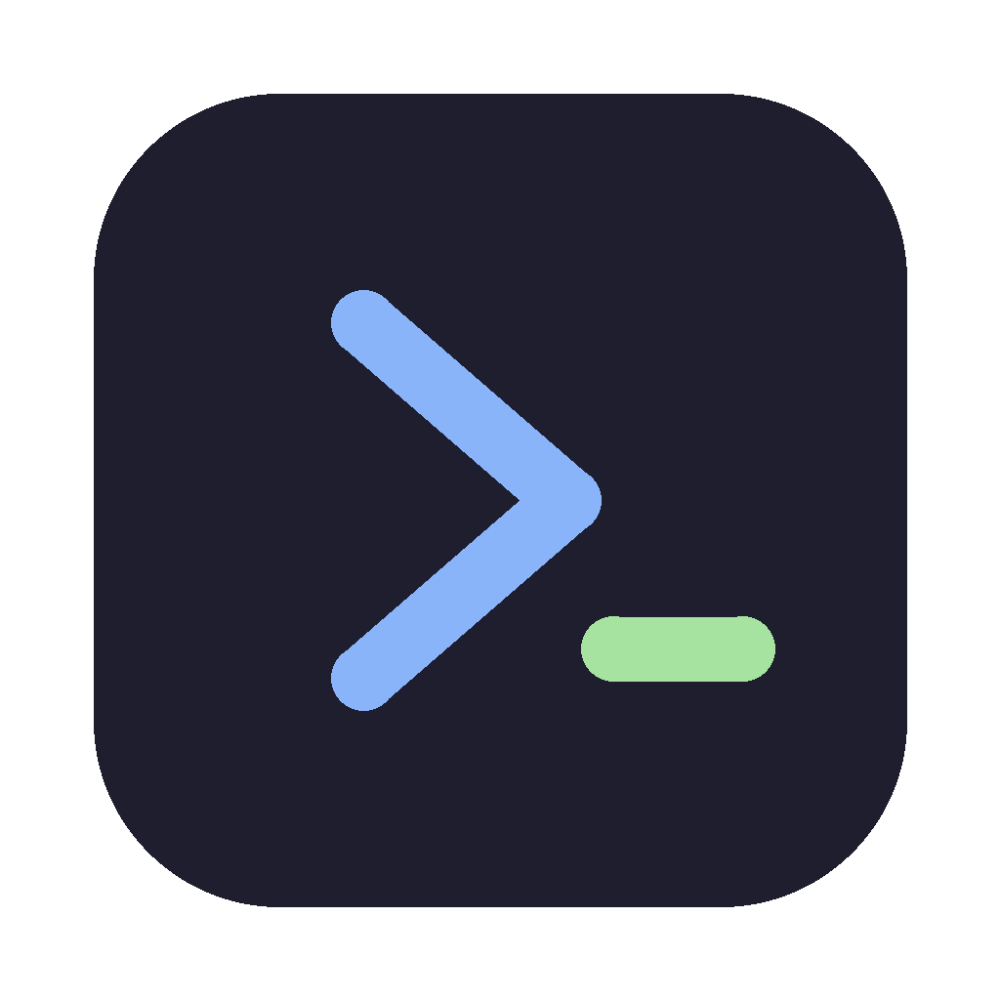

  

<h1 align="center">PyForge</h1>

  <b>Write and run code in a dozen languages — on Android, Mac, Windows &amp; Linux.</b> 
  A full code editor with real interpreters built in. Offline. Free. No account.

  <a href="https://pyforge-app.github.io"><b>🌐 Website</b></a> &nbsp;·&nbsp;
  <a href="https://github.com/pyforge-app/pyforge/releases/latest"><b>⬇️ Download</b></a>

  
  
  
  

---

## What is PyForge?

PyForge is a code editor **and runtime** that runs twelve languages for real, right on your device — no internet, no server, no account. Pick a language, write code, hit **Run**, and it executes on the spot. It started as a way to code on a handheld Android console and now runs everywhere.

## Languages

**Run on-device:** Python · JavaScript · Java · C · Lua · Ruby · Scheme · BASIC · Assembly (x86-64) · Binary · HTML/CSS
**Editor only:** C++ *(on Android — C++ compiles and runs on the Mac/Windows/Linux desktop app)*

## Download

| Platform | File | |
|---|---|---|
| **Android** 7+ | `.apk` | [Download](https://github.com/pyforge-app/pyforge/releases/download/v1.0/PyForge.apk) |
| **macOS** · Apple Silicon | `.dmg` | [Download](https://github.com/pyforge-app/pyforge/releases/download/v1.0/PyForge-mac.dmg) |
| **Windows** 10+ · x64 | `.zip` | [Download](https://github.com/pyforge-app/pyforge/releases/download/v1.0/PyForge-windows.zip) |
| **Linux** · x64 | `.AppImage` | [Download](https://github.com/pyforge-app/pyforge/releases/download/v1.0/PyForge-linux.AppImage) |

All builds are **unsigned**, so your OS asks permission the first time:
Android → *allow install from this source* · macOS → *right-click → Open* · Windows → *More info → Run anyway* · Linux → `chmod +x` the AppImage.

## Features

- **Real interpreters bundled** — CPython, Lua, mruby, PicoC, s7, MY-BASIC, and a hand-built x86 emulator. Nothing phones home.
- **A proper editor** — syntax highlighting, autocomplete, bracket matching, auto-indent, dark theme, for every language.
- **Run · Stop · Input** — feed a program standard input, watch output live, and stop a runaway loop with one tap.
- **A files library** — save, open, rename, delete and share your programs.
- **Bring your own libraries** *(desktop)* — install Python (`pip`) and Ruby (`gem`) packages from inside the editor; your code can `import` them.
- **Same app everywhere** — Android in your pocket, the desktop app on Mac, Windows or Linux.

## How it works

The editor is one shared HTML/CSS/JS front-end (CodeMirror). On **Android** it runs in a WebView with native interpreters wired in through JNI — Chaquopy for CPython, plus Lua, Ruby, C, Scheme and BASIC compiled straight into the app. On the **desktop** it's an Electron app that runs your code through bundled interpreter binaries and the tools already on your system. JavaScript, Binary, HTML/CSS and Assembly run entirely in the front-end.

## License

[MIT](LICENSE) — free to use, modify and share.
